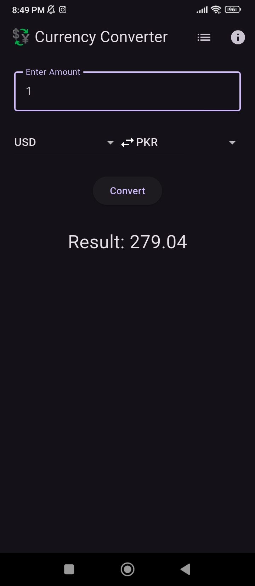
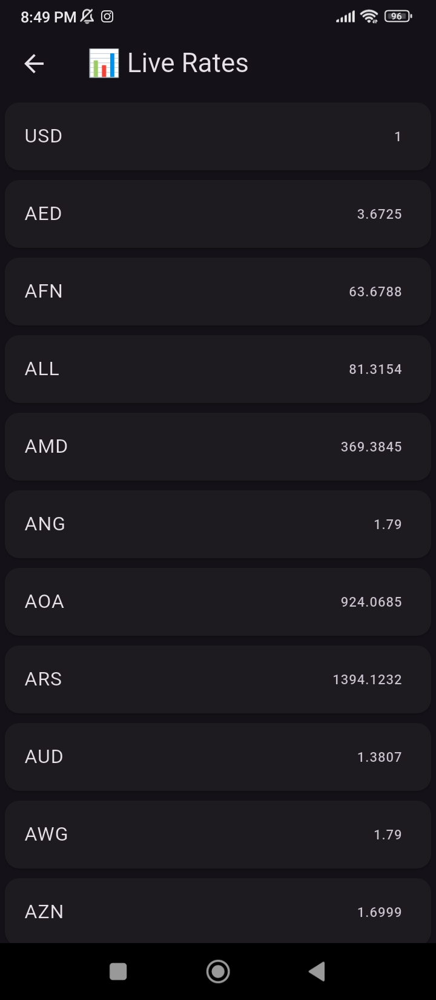
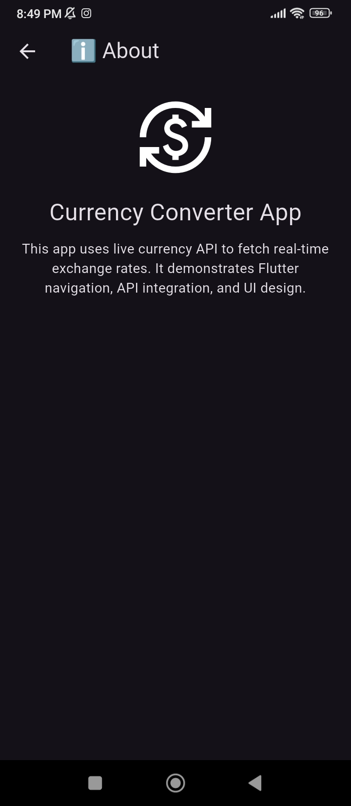

# 💱 Currency Converter App (Flutter)

A simple and modern **Flutter Currency Converter App** that uses a live currency exchange API to convert between different currencies in real-time.

---

## 🚀 Features

- 🌍 Live currency conversion using API
- 💱 Multiple currencies support (USD, PKR, EUR, INR, AED etc.)
- 🔄 Easy swap between currencies
- 📊 Live rates screen
- ℹ️ About page
- 🎨 Clean and modern UI
- 📱 Fully responsive Android app

---

## 🛠️ Tech Stack

- Flutter (Dart)
- HTTP Package
- ExchangeRate API
- Android Studio

---

## 🌐 API Used

This project uses:

ExchangeRate API  
https://www.exchangerate-api.com/

- Provides real-time currency exchange rates
- Free tier used for development

---
## 📸 Screenshots

| Home Screen | 
|-------------|
| | 

### ℹ️ Rates Screen


### ℹ️ About Screen



## 📦 Dependencies

Add this in `pubspec.yaml`:

```yaml
dependencies:
  flutter:

    sdk: flutter
  http: ^1.2.0
